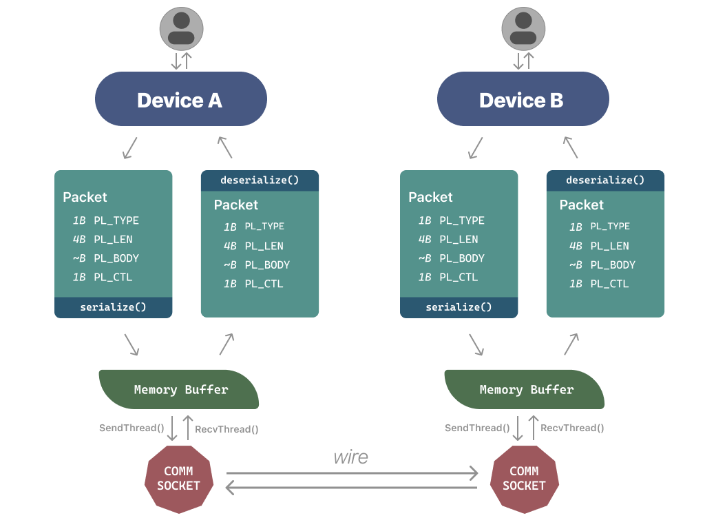
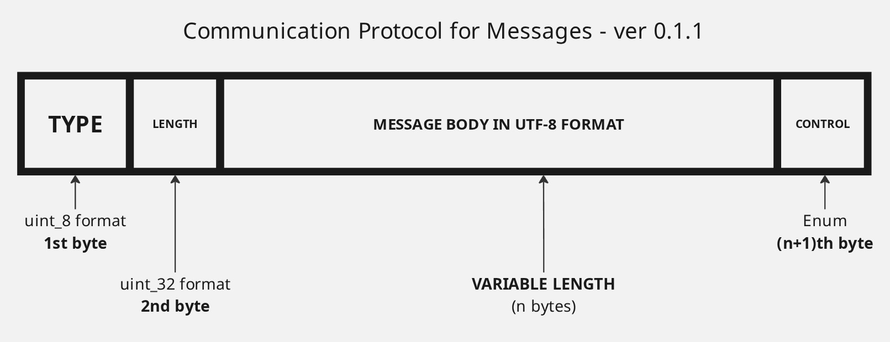

<h1 align="center"> WireSend </h1>
<p align = "center">
  
</p>


> I have completed development for this project. It was a good journey!

A FTP project that can send files between two devices connected on a same local network (only works on Unix based systems--not tested on macOS, though it should work).

---
## Architecture
WireSend has an asynchronous messaging and file sending protocol that supports serializing/deserializing techniques to send data efficiently over the wire. Have a look below!



Here's a precise protocol design for messaging and file transfer (note: we convert UTF-8 into binary before sending. That way it is also suitable for sending files). Here the packet structure is same for the message and the file data: we serialize and fill both of them into the message body. We just parse file contents differently than message packets and then write it to disk.

 

---

## Building

Just run the makefile. Note, the binary provided is compiled for Linux x86. In case you have a macOS or Linux ARM, please download the source and run the make command.
```bash
make all
```

---

## Usage

### Start a server and choose a port

```bash
./wires server <port>
```

### Connect as a client

```bash
./wires <ip-address> <port>
```

Replace `<ip-address>` and `<port>` with the values shown when the server starts.

### Sending messages and files
For messages, just type in messages and press enter to send. For files however we have a few commands:

```bash
/f
```
This opens a file picker prompt. Called from the sender side.
```bash
/a
```
This accepts the incoming file from the sender (runs on the receiver side).

```bash
/r
```
This rejects the incoming file from the sender (runs on the receiver side).

**Note: After sending file sending request and upon receiving the acceptance from the receiver side, you must send a (any) message from the sender side to actuallly start transferring the file. Or else it's just going to do nothing like a dummy :C**

---

### Stopping the server
You can use the following command to stop (or just terminate the terminal session, but not recommended. Its rude, right?):

```bash
/stop
```
This stops the server, and then you must terminate the client session to clean up.

## Debugging

Add the `-dbg` flag to enable debugging mode:

```bash
./wires server <port> -dbg
./wires <ip-address> <port> -dbg
```

And that's it! I've been working on this project for more 5 months (quite a long time) and I finally managed to make the file transfer work. It was a good journey--I learnt about networking, socket programming, many Linux APIs, multi-threading stuff, etc. I know the code quality might be atrocious, but hey, it works. (hehe). Thanks for reading this! Have a great day!
